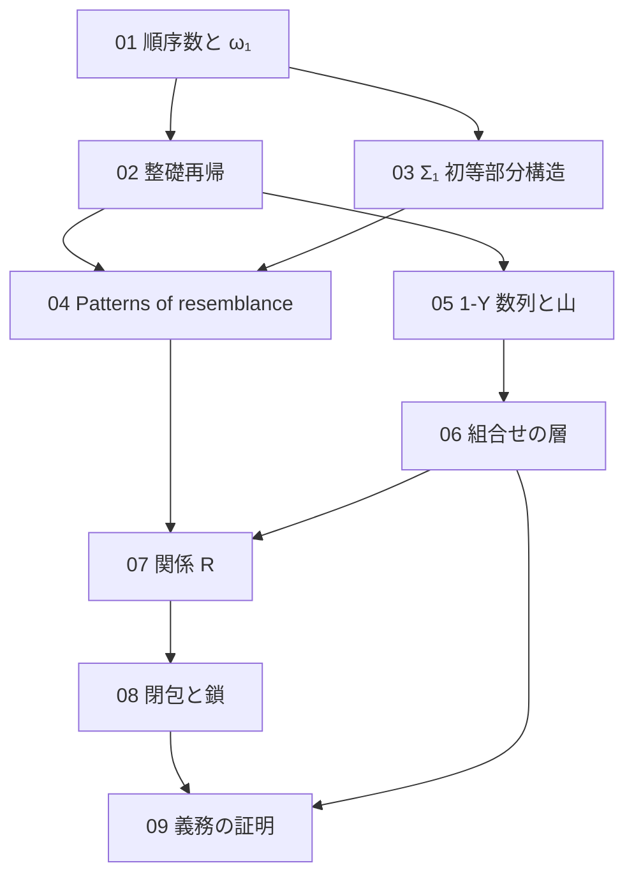

[← Back](../README.md) | [English](en/README.md) | [Japanese](README.md)

# study/

このリポジトリを読むための背景ノート。証明が既知として使う数学（順序数、整礎再帰、モデル論）と、証明の 2 つの層（Phyrion 氏の組合せの層と、このリポジトリの意味の層）を、定義と小さい例から書き起こす。どのノートも、Lean のコードが実際にしていることに合わせ、Lean の名前を挙げる。

書き方は [rule.md](rule.md) に定める。

## 目次

| ノート | 内容 | このリポジトリでの対応箇所 |
|---|---|---|
| [01 順序数と ω₁](01-ordinals.md) | 整列順序、後者と極限、上限、可算、$`\omega_1`$ の正則性、可算順序数の数え上げ | README「関係 R」「6 つの仮定の行き先」、notes/01-design.md §3.6、§4.7、[Por/Omega1.lean](../Por/Omega1.lean) |
| [02 整礎関係と整礎再帰](02-well-founded.md) | `Acc`、整礎帰納法、辞書式積、整礎再帰、ガードつきの再帰、ラベルによる停止 | README「関係 R」、notes/01-design.md §3.1、§4.1、[Por/Relation.lean](../Por/Relation.lean)、`OneY/RootIndexed/ExpansionWellFounded.lean` |
| [03 構造と Σ₁ 初等部分構造](03-sigma1-elementary.md) | 構造、$`\Sigma_1`$ 論理式、原子図式、$`\preccurlyeq_{\Sigma_1}`$、Tarski–Vaught 判定法、Lean での論理式、見えるビット | README「関係 R」、notes/01-design.md §3.2〜§3.4、[Por/Formula.lean](../Por/Formula.lean) |
| [04 Patterns of resemblance](04-patterns-of-resemblance.md) | Carlson の $`\le_1`$、小さい例、有限反映の形、bms-elem-pattern、1-Y で足りないもの | README「証明の形」、notes/01-design.md §1、§3.8、§6.3 |
| [05 1-Y 数列と山](05-1y-mountain.md) | 式、山の行、差と親、高さ、層、悪い根、展開の例 | README「記号」「最終定理 4 つ」、notes/01-design.md §2.1、`ZeroY/`、`OneY/` |
| [06 Phyrion 氏の組合せの層](06-combinatorial-layer.md) | 図式、表現、上端への要求、有限反映、6 つの仮定、末尾のラベルによる降下 | README「証明の形」「6 つの仮定の行き先」、notes/01-design.md §2、`OneY/RootIndexed/` |
| [07 関係 R](07-relation-r.md) | 段 $`(k, \eta)`$ の構造、$`R`$ の定義、（上端、層、添字）の再帰、`R_iff`、`R_lt`、`R_weaken` | README「関係 R」、notes/01-design.md §3.3〜§3.8、§4.1〜§4.4、[Por/Relation.lean](../Por/Relation.lean) |
| [08 ω₁ より下の閉包と鎖](08-closure-chain.md) | Good、証人の高さ、next、λ、`lam_good`、鎖 | README「6 つの仮定の行き先」、notes/01-design.md §3.6、§4.7、[Por/Closure.lean](../Por/Closure.lean)、[Por/Chain.lean](../Por/Chain.lean) |
| [09 義務の証明](09-obligations.md) | O1〜O7、`finiteReflection`、`top_abs`、`chain_R`、`initial_all`、最終定理 | README「6 つの仮定の行き先」「公理の監査」、notes/01-design.md §2.3、§4、[Por/Reflection.lean](../Por/Reflection.lean)、[Por/Chain.lean](../Por/Chain.lean)、[Por/Model.lean](../Por/Model.lean)、[Por/WellOrdering.lean](../Por/WellOrdering.lean) |

## 読む順

