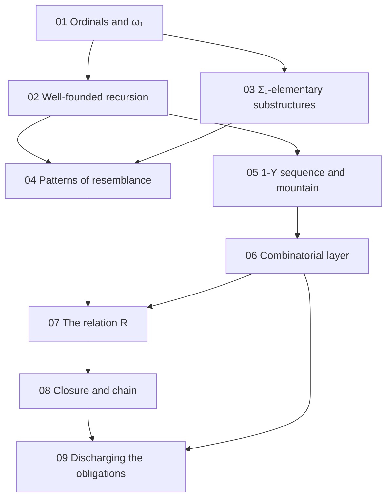

[← Back](../../README-en.md) | [English](README.md) | [Japanese](../README.md)

# study/

Background notes for reading this repository. They write out, from definitions and small examples, the mathematics the proof takes as known (ordinals, well-founded recursion, model theory) and the two layers of the proof (Phyrion's combinatorial layer and the semantic layer of this repository). Every note follows what the Lean code actually does and names the Lean declarations.

The writing rules are fixed in [rule.md](rule.md).

## Contents

| Note | Topic | Where it is used in this repository |
|---|---|---|
| [01 Ordinals and ω₁](01-ordinals.md) | well-orders, successors and limits, suprema, countability, regularity of $`\omega_1`$, enumerating countable ordinals | README "The relation R", "Where the six hypotheses go"; notes/01-design.md §3.6, §4.7; [Por/Omega1.lean](../../Por/Omega1.lean) |
| [02 Well-founded relations and recursion](02-well-founded.md) | `Acc`, well-founded induction, lexicographic products, well-founded recursion, guarded recursion, termination by labels | README "The relation R"; notes/01-design.md §3.1, §4.1; [Por/Relation.lean](../../Por/Relation.lean); `OneY/RootIndexed/ExpansionWellFounded.lean` |
| [03 Structures and Σ₁-elementary substructures](03-sigma1-elementary.md) | structures, $`\Sigma_1`$ formulas, atomic diagrams, $`\preccurlyeq_{\Sigma_1}`$, the Tarski–Vaught test, formulas in Lean, visible bits | README "The relation R"; notes/01-design.md §3.2–§3.4; [Por/Formula.lean](../../Por/Formula.lean) |
| [04 Patterns of resemblance](04-patterns-of-resemblance.md) | Carlson's $`\le_1`$, small examples, the shape of finite reflection, bms-elem-pattern, what is missing for 1-Y | README "Shape of the proof"; notes/01-design.md §1, §3.8, §6.3 |
| [05 The 1-Y sequence and its mountain](05-1y-mountain.md) | expressions, rows of the mountain, differences and parents, heights, layers, the bad root, examples of expansion | README "Notation", "The four final theorems"; notes/01-design.md §2.1; `ZeroY/`, `OneY/` |
| [06 Phyrion's combinatorial layer](06-combinatorial-layer.md) | diagrams, representations, demands toward the top, finite reflection, the six hypotheses, descent of the last label | README "Shape of the proof", "Where the six hypotheses go"; notes/01-design.md §2; `OneY/RootIndexed/` |
| [07 The relation R](07-relation-r.md) | the structures of level $`(k, \eta)`$, the definition of $`R`$, the (top, layer, index) recursion, `R_iff`, `R_lt`, `R_weaken` | README "The relation R"; notes/01-design.md §3.3–§3.8, §4.1–§4.4; [Por/Relation.lean](../../Por/Relation.lean) |
| [08 Closure below ω₁ and the chain](08-closure-chain.md) | Good, heights of witnesses, next, λ, `lam_good`, the chain | README "Where the six hypotheses go"; notes/01-design.md §3.6, §4.7; [Por/Closure.lean](../../Por/Closure.lean), [Por/Chain.lean](../../Por/Chain.lean) |
| [09 Discharging the obligations](09-obligations.md) | O1–O7, `finiteReflection`, `top_abs`, `chain_R`, `initial_all`, the final theorems | README "Where the six hypotheses go", "Axiom audit"; notes/01-design.md §2.3, §4; [Por/Reflection.lean](../../Por/Reflection.lean), [Por/Chain.lean](../../Por/Chain.lean), [Por/Model.lean](../../Por/Model.lean), [Por/WellOrdering.lean](../../Por/WellOrdering.lean) |

The notes in `notes/` are in Japanese.

## Reading order

